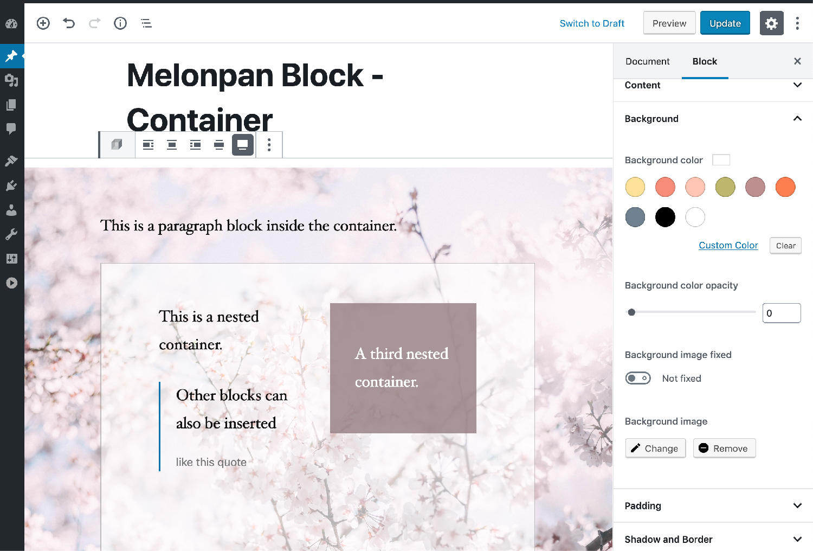

# Melonpan Block - Container

WordPress Block that provides a container block which can have other blocks nested.

## Features

The plugin comes with the following settings:

- Background image, fixed, color & opacity
- Content align, max-width, text color
- Border width, color & opacity
- Shadow width, color & opacity
- Padding top, bottom, left, right, responsive paddings

Developers: The plugin comes with a filter to register your own block based on this one. Check the _How can I use the filter to register my own block?_ section for more info. To check the documentation please refer to the [WordPress repository](https://wordpress.org/plugins/melonpan-block-container/) (until the documentation page is finished).

 

 

---

This plugin can be downloaded from the [WordPress repository](https://wordpress.org/plugins/melonpan-block-container/).
