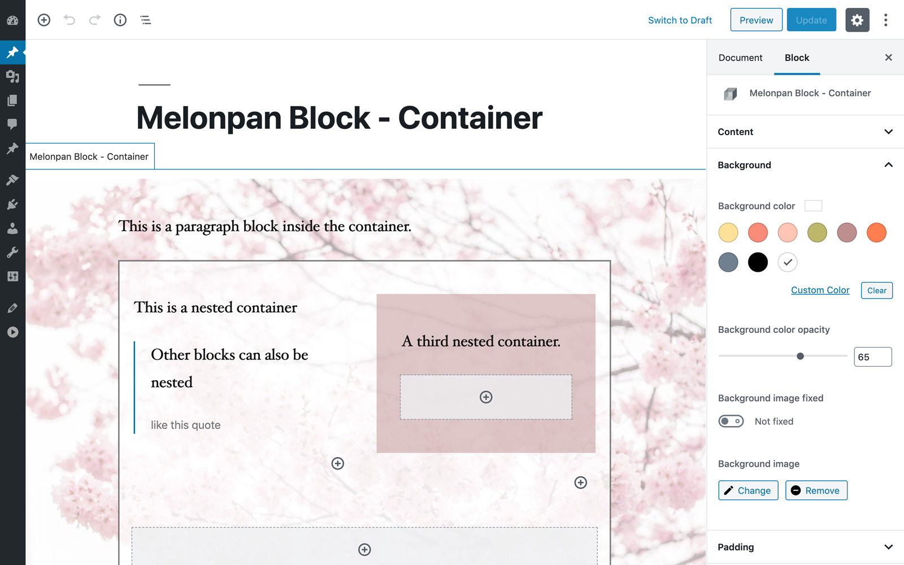

# Melonpan Block - Container

[Demo](https://gutenberg-showcase.melonpan.io/melonpan-block-container) - [Documentation](https://melonpan.io/gutenberg-blocks/melonpan-block-container) - [WordPress](https://wordpress.org/plugins/melonpan-block-container)

 

WordPress Block that provides a container, with styling features, which can have other blocks nested.

 

## Features

The block comes with the following settings:

- Background image, fixed, color & opacity
- Content align, max-width, text color
- Border width, color & opacity
- Shadow width, color & opacity
- Padding top, bottom, left, right, responsive paddings

 

## Developers

The plugin comes with a filter to register your own block based on this one. For more information check the [documentation](https://melonpan.io/gutenberg-blocks/melonpan-block-container/registering-a-custom-block).

 

## Screenshots

